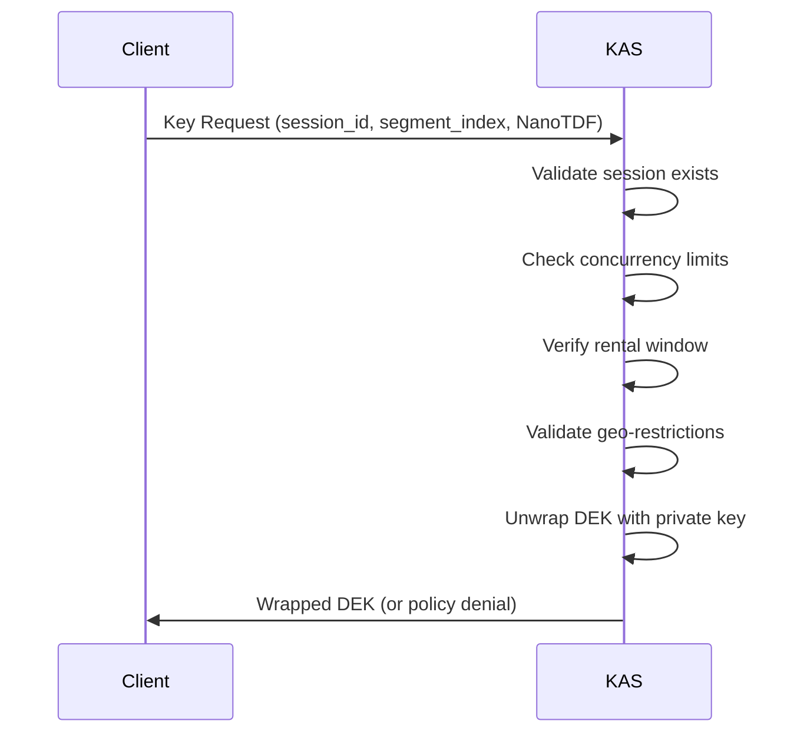

# Security Guide

## Threat Model

ArkavoMediaKit is designed to protect premium video content from unauthorized access and piracy while providing an open alternative to proprietary DRM systems.

### Assets Being Protected

1. **Video Content**: Premium movies, TV shows, live streams
2. **Encryption Keys**: Per-segment DEKs wrapped in NanoTDF
3. **User Entitlements**: Subscription status, rental windows, concurrency limits
4. **Session Data**: Active playback sessions and user activity

### Threat Actors

1. **Casual Pirates**: Screen recording, sharing credentials
2. **Commercial Pirates**: Content ripping, redistribution at scale
3. **Malicious Users**: DRM circumvention, reverse engineering
4. **Compromised Devices**: Malware, jailbroken devices

### Attack Vectors

1. **Key Extraction**: Extracting DEKs from memory or network traffic
2. **Policy Bypass**: Circumventing geo-restrictions, concurrency limits
3. **Replay Attacks**: Reusing captured keys or sessions
4. **Man-in-the-Middle**: Intercepting KAS communication
5. **Client Tampering**: Modified apps, debugging, code injection

## Security Architecture

### Per-Segment Encryption

Each HLS segment is encrypted with a unique AES-256-GCM key:

```
Segment 0: DEK₀ (unique, one-time use)
Segment 1: DEK₁ (unique, one-time use)
...
```

**Benefits**:
- Forward secrecy: Compromising one key doesn't expose other segments
- Granular access control: Different policies per segment possible
- Mitigation: Limits exposure if a key is extracted

### TDF3 Key Wrapping

DEKs are wrapped in NanoTDF format with policy bindings:

```
NanoTDF = {
    header: {
        ephemeral_public_key,
        policy: {asset_id, segment_index, rental_window, ...},
        policy_binding: GMAC(policy, DEK)
    },
    payload: Encrypt_KAS_PubKey(DEK)
}
```

**Security Properties**:
- **Authenticity**: Policy binding ensures policy can't be modified
- **Confidentiality**: DEK encrypted with KAS public key (ECIES)
- **Integrity**: AES-GCM provides authenticated encryption

### Policy Enforcement

Policies are evaluated at the KAS during key requests:



## Production Security Requirements

### 1. TLS Certificate Pinning

**Risk**: MITM attacks on KAS communication
**Mitigation**: Pin KAS server certificates

```swift
// Implement in URLSession delegate
func urlSession(
    _ session: URLSession,
    didReceive challenge: URLAuthenticationChallenge,
    completionHandler: @escaping (URLSession.AuthChallengeDisposition, URLCredential?) -> Void
) {
    guard let serverTrust = challenge.protectionSpace.serverTrust,
          let certificate = SecTrustGetCertificateAtIndex(serverTrust, 0) else {
        completionHandler(.cancelAuthenticationChallenge, nil)
        return
    }

    // Validate against pinned certificate
    let pinnedCertData = loadPinnedCertificate()
    let serverCertData = SecCertificateCopyData(certificate) as Data

    if serverCertData == pinnedCertData {
        completionHandler(.useCredential, URLCredential(trust: serverTrust))
    } else {
        completionHandler(.cancelAuthenticationChallenge, nil)
    }
}
```

### 2. Input Validation

**Risk**: SQL injection, command injection via user-controlled strings
**Mitigation**: Already implemented via `InputValidator`

Validates:
- Asset IDs (alphanumeric + hyphens/underscores, max 256 chars)
- User IDs (alphanumeric + @.-_, max 256 chars)
- Region codes (2-letter ISO 3166-1)
- Policy attributes (URL-encoded, max 512 chars)

### 3. Rate Limiting

**Risk**: Brute force attacks, DDoS
**Mitigation**: Implement per-user rate limits

```rust
// In arkavo-rs KAS server
#[derive(Debug, Clone)]
pub struct RateLimiter {
    max_requests_per_minute: u32,
    user_requests: Arc<Mutex<HashMap<String, (u32, Instant)>>>,
}

impl RateLimiter {
    pub fn check_rate_limit(&self, user_id: &str) -> Result<(), RateLimitError> {
        // Allow max 60 key requests per minute per user
        // ...
    }
}
```

**Recommended Limits**:
- Key requests: 60/minute per user
- Session starts: 10/minute per user
- Failed auth attempts: 5/minute per IP

### 4. Audit Logging

**Risk**: No forensics after security incident
**Mitigation**: Log all security-relevant events

**Required Log Events**:
```json
{
  "event": "KEY_REQUEST",
  "timestamp": "2025-10-06T20:00:00Z",
  "user_id": "hashed_user_id",
  "asset_id": "movie-12345",
  "segment_index": 5,
  "session_id": "uuid",
  "result": "success",
  "latency_ms": 15,
  "client_ip": "192.168.1.1",
  "geo_region": "US"
}
```

```json
{
  "event": "POLICY_DENIAL",
  "timestamp": "2025-10-06T20:00:00Z",
  "user_id": "hashed_user_id",
  "reason": "concurrency_limit_exceeded",
  "policy": {"max_streams": 2, "current_streams": 3}
}
```

**Log Storage**:
- Centralized log aggregation (e.g., NATS, Elasticsearch)
- Retention: 90 days minimum
- PII: Hash user IDs, don't log full IPs

### 5. Key Rotation

**Risk**: Long-lived KAS keys increase exposure window
**Mitigation**: Regular KAS key rotation

**Recommended Schedule**:
- KAS key pair: Rotate every 90 days
- Emergency rotation: Within 24 hours if compromised

**Rotation Process**:
1. Generate new KAS key pair
2. Deploy new public key to clients
3. Configure KAS to accept both old and new keys (overlap period)
4. After 7 days, retire old key
5. Monitor for decryption failures

### 6. Session Security

**Risk**: Session hijacking, replay attacks
**Mitigation**: Already implemented

- Session IDs are UUIDs (non-guessable)
- Sessions timeout after 5 minutes without heartbeat
- User ID validation on all requests prevents cross-user hijacking

**Additional Hardening**:
```swift
// Add session token binding
struct MediaSession {
    let sessionID: UUID
    let userID: String
    let deviceFingerprint: String  // Bind to device
    let creationIP: String          // Check IP changes
    // ...
}
```

## Runtime Security

### 1. Code Obfuscation

**Risk**: Reverse engineering of client code
**Mitigation**: Code obfuscation (limited effectiveness)

**Recommendations**:
- Use Swift's built-in optimizations (Release build)
- Consider commercial obfuscation tools for high-value content
- Accept that determined attackers will reverse engineer

### 2. Jailbreak/Root Detection

**Risk**: Modified OS allows key extraction
**Mitigation**: Device security level checks

```swift
public struct DeviceInfo {
    let securityLevel: DeviceSecurityLevel
    let isVirtualMachine: Bool

    static func detect() -> DeviceInfo {
        #if os(iOS)
        // Check for jailbreak indicators
        let isJailbroken = checkJailbreak()
        let secLevel: DeviceSecurityLevel = isJailbroken ? .low : .high
        #else
        let secLevel: DeviceSecurityLevel = .medium
        #endif

        // VM detection
        let isVM = detectVirtualMachine()

        return DeviceInfo(securityLevel: secLevel, isVirtualMachine: isVM)
    }
}
```

**Jailbreak Detection** (iOS):
- Check for Cydia/Sileo apps
- Attempt write to `/private` (should fail)
- Check for suspicious libraries
- Fork detection (jailbroken devices allow forking)

### 3. Memory Protection

**Risk**: DEKs extracted from memory via debugger
**Mitigation**: Minimize key lifetime

```swift
// Use SymmetricKey (protected memory when possible)
let key = SymmetricKey(size: .bits256)

// Zero out after use
defer {
    // SymmetricKey is automatically zeroed when deallocated
}

// Don't log keys
#if DEBUG
assert(!debugDescription.contains(key))
#endif
```

### 4. Anti-Debugging

**Risk**: Debugger attachment allows key extraction
**Mitigation**: Detect debuggers

```swift
func isDebuggerAttached() -> Bool {
    var info = kinfo_proc()
    var mib: [Int32] = [CTL_KERN, KERN_PROC, KERN_PROC_PID, getpid()]
    var size = MemoryLayout<kinfo_proc>.stride

    let result = sysctl(&mib, UInt32(mib.count), &info, &size, nil, 0)
    return (result == 0) && ((info.kp_proc.p_flag & P_TRACED) != 0)
}

// Check periodically
if isDebuggerAttached() {
    // Refuse to decrypt keys
    throw SecurityError.debuggerDetected
}
```

## Network Security

### 1. HTTPS Only

All communication must use TLS 1.3:

```swift
let kasURL = URL(string: "https://kas.arkavo.net")!
// Never use http:// in production
```

### 2. Request Authentication

**Risk**: Unauthorized key requests
**Mitigation**: OAuth/JWT tokens

```swift
// Add to key requests
struct KeyAccessRequest {
    let sessionID: UUID
    let userID: String
    let assetID: String
    let authToken: String  // JWT with claims: user_id, exp, iat
    // ...
}
```

**JWT Claims**:
```json
{
  "sub": "user-001",
  "iss": "arkavo-auth",
  "aud": "arkavo-kas",
  "exp": 1728259200,
  "iat": 1728255600,
  "entitlements": {
    "subscription": "premium",
    "assets": ["movie-12345"]
  }
}
```

### 3. CDN Security

**Risk**: Direct access to encrypted segments bypasses DRM
**Mitigation**: Signed URLs with expiration

```swift
// Generate signed CDN URLs
func generateSignedURL(segment: SegmentMetadata, expiresIn: TimeInterval) -> URL {
    let expiration = Date().addingTimeInterval(expiresIn)
    let signature = HMAC<SHA256>.authenticationCode(
        for: segment.url.path.data(using: .utf8)!,
        using: cdnSigningKey
    )

    var components = URLComponents(url: segment.url, resolvingAgainstBaseURL: false)!
    components.queryItems = [
        URLQueryItem(name: "expires", value: String(Int(expiration.timeIntervalSince1970))),
        URLQueryItem(name: "signature", value: signature.hexString)
    ]

    return components.url!
}
```

## Compliance Considerations

### HDCP Requirements

For 4K/HDR content, studios may require HDCP 2.2:

```swift
let policy = MediaDRMPolicy(
    hdcpLevel: .type1,  // HDCP 2.2
    minSecurityLevel: .high
)
```

**Enforcement**:
- Check device capabilities before playback
- Validate during key requests
- Downgrade resolution if HDCP insufficient

### Privacy (GDPR, CCPA)

**PII in Logs**:
- Hash user IDs: `SHA256(user_id + salt)`
- Truncate IPs: `192.168.1.0/24` instead of `192.168.1.100`
- Don't log playback positions (user tracking)

**Data Retention**:
- Active sessions: 5 minutes after last heartbeat
- Audit logs: 90 days
- User consent: Required for analytics

## Incident Response

### If KAS Key Compromised

1. **Immediately**: Rotate KAS keys (emergency procedure)
2. **Notify**: Content providers of potential exposure
3. **Revoke**: All keys issued with compromised KAS key
4. **Investigate**: How key was compromised, extent of exposure
5. **Update**: Clients to use new KAS public key

### If Content Leaked

1. **Identify**: Which segments/assets leaked
2. **Forensics**: Check audit logs for suspicious activity
3. **Watermarking**: If implemented, trace leak source
4. **Mitigate**: Rotate keys for affected content
5. **Legal**: DMCA takedowns, legal action

## Security Testing

### Penetration Testing

**Recommended Tests**:
- MITM attacks on KAS communication
- Session hijacking attempts
- Policy bypass attempts
- Replay attacks with captured keys
- Brute force rate limit testing

### Automated Security Scanning

```bash
# Dependency scanning
swift package show-dependencies

# Code scanning
swiftlint --strict
swift-format lint --strict

# SAST scanning
# (Use commercial tools like Checkmarx, Veracode)
```

## Security Checklist

Before Production Deployment:

- [ ] TLS certificate pinning implemented
- [ ] Rate limiting configured
- [ ] Audit logging enabled
- [ ] KAS key rotation procedure documented
- [ ] Input validation tested (fuzzing)
- [ ] Penetration test completed
- [ ] Incident response plan documented
- [ ] GDPR/CCPA compliance reviewed
- [ ] Security training for ops team
- [ ] Monitoring and alerting configured

## Contact

For security issues:
- **DO NOT** open public GitHub issues
- Email: security@arkavo.com (if available)
- Responsible disclosure: 90 days

## References

- [OpenTDF Security Spec](https://github.com/opentdf/spec)
- [OWASP Mobile Top 10](https://owasp.org/www-project-mobile-top-10/)
- [Apple Platform Security](https://support.apple.com/guide/security/)
- [NIST SP 800-175B](https://csrc.nist.gov/publications/detail/sp/800-175b/final) - Key Management
