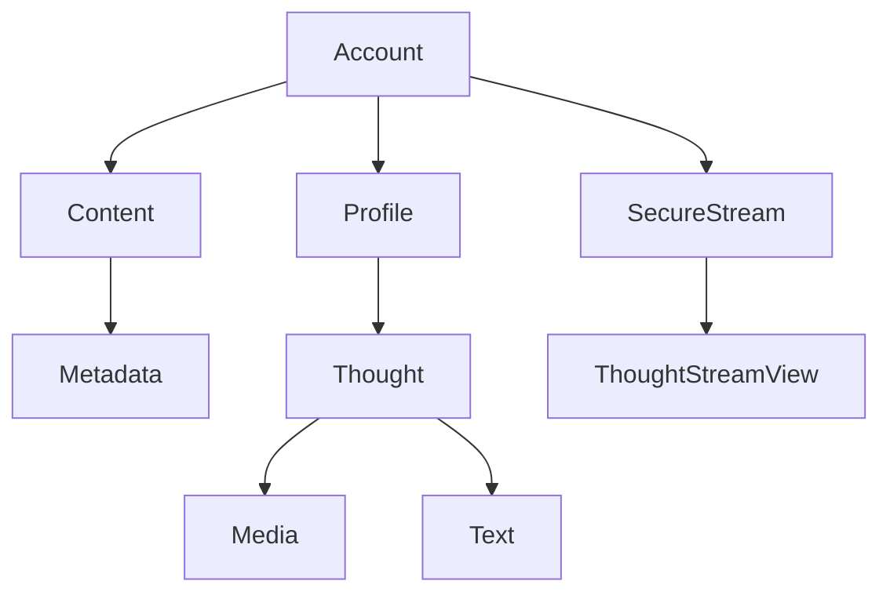

# Arkavo app
_for the Apple ecosystem_

## Design

### Entity



## Development

### Dependencies 

- OpenTDFKit https://github.com/arkavo-org/OpenTDFKit.git

### Format

```shell
swiftformat --swiftversion 6.0 .
```
