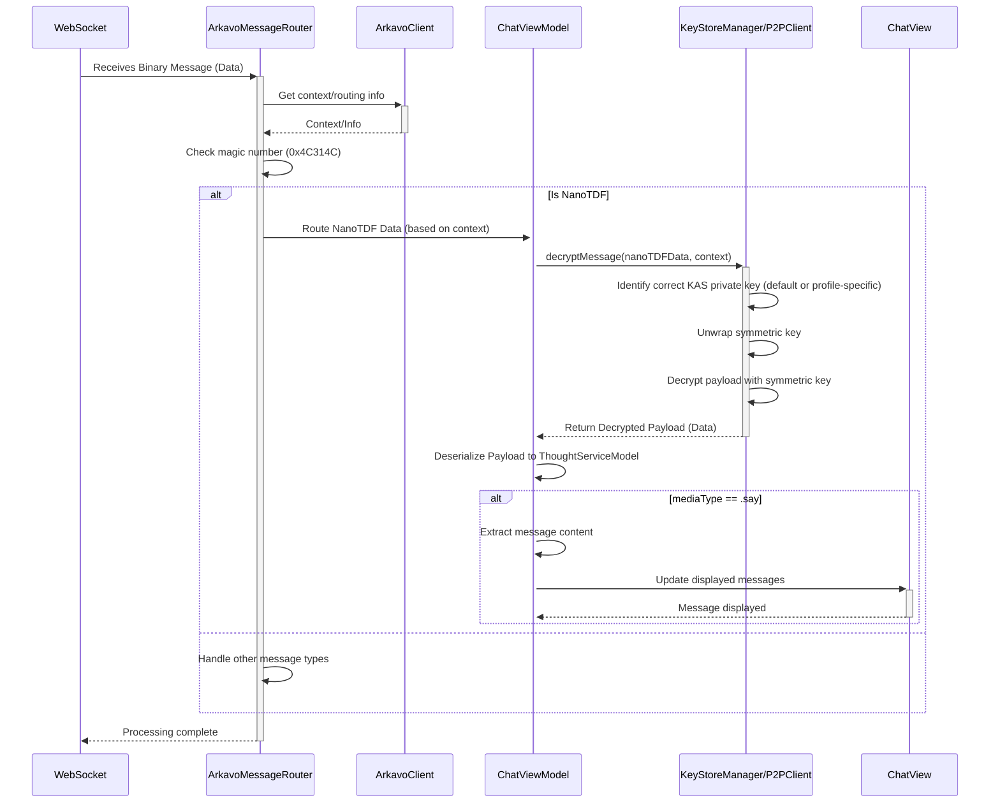
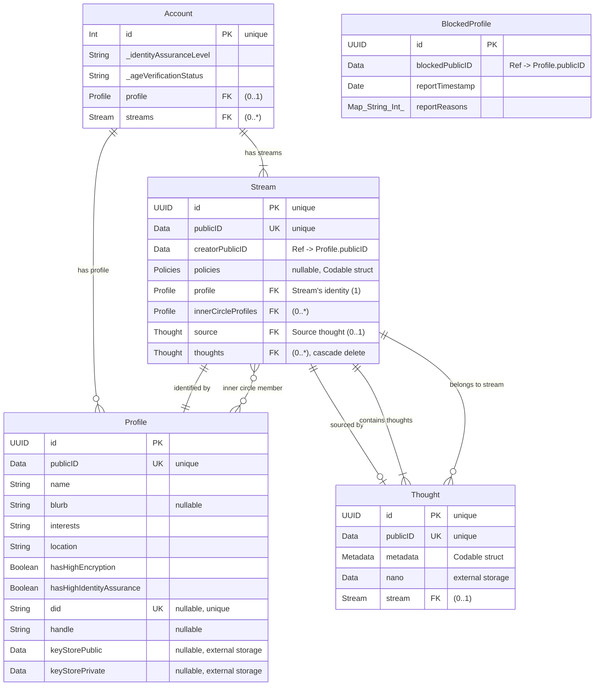

# Arkavo app
_for the Apple ecosystem_

## Prerequisites

Flatbuffers
https://github.com/google/flatbuffers

```shell
brew install flatbuffers
```

## Features

### One-Time TDF (Trusted Data Format)

One-Time TDF combines the trusted data format with a one‑time pad encryption scheme to achieve perfect forward secrecy for each message. Key features include:

- **Perfect Forward Secrecy**: Every message is encrypted with a unique, randomly generated symmetric key that is discarded after a single use.
- **Peer-to-Peer Communication**: Devices discover and communicate directly (using frameworks like MultipeerConnectivity) without relying on a central server.
- **Secure Key Exchange**: Peers securely exchange public keys via a PublicKeyStore, enabling encrypted key sharing while keeping private keys secret.
- **Key Access Service (KAS) Flexibility**: The system uses a default public key for the KAS to wrap the per-message symmetric keys. However, in specific contexts like `InnerCircle` streams, the public key from a participant's `PublicKeyStore` is used as the KAS key, ensuring the message can only be unwrapped by the intended recipient(s).
- **Inner Circle Group**: Automatically creates a private communication group (an “inner circle”) for trusted contacts.
- **Key Rotation and Renewal**: Keys are automatically marked as used when utilized. When the key store nears depletion, peers must meet in-person and use P2P connectivity to generate a new key store, which is an intensive manual process.
- **Scalable Implementation**: Supports a large key pool (e.g., capacity of 8192 keys) to cover extended messaging needs over time.

#### Technical Implementation

- **P2P Discovery and Messaging**: Uses the MultipeerConnectivity framework for secure, nearby device discovery and direct messaging.
- **PublicKeyStore Integration**: Implements a secure key exchange mechanism where only public keys are shared, and each message is encrypted using a one‑time key from the recipient’s key pool.
- **One-Time Key Usage**: Each message uses a unique key from the key store. After encryption, the key is immediately removed (or flagged as “used”) to enforce one‑time use.
- **Key Management**: A key management system monitors the key pool for each P2P relationship. When the number of available keys is running low for a specific peer, renewal is required. Key renewal involves an in-person meeting (or secure P2P confirmation) to generate new keys and exchange public components.
- **TDF Packaging**: The encrypted payload is wrapped in a TDF container (leveraging OpenTDFKit) that binds attribute‑based policies to the data, ensuring end‑to‑end security and auditability. The symmetric key used for encryption is wrapped using the appropriate KAS public key (either the default or a participant's key).

#### Security Benefits

- **Robust Confidentiality**: Even if keys are later compromised, previously used one‑time keys leave past messages secure.
- **Decentralized and Serverless**: Eliminates the need for a central key server for most operations, reducing single points of failure and attack.
- **End-to-End Protection**: Encrypts messages directly between peers without intermediaries, ensuring data integrity and confidentiality.
- **Interoperability with TDF Infrastructure**: Seamlessly integrates with existing Trusted Data Format encryption systems, enabling enhanced policy enforcement and auditability.

## Development

### Testing

#### Testing Trust Revocation

To manually test the trust revocation feature, follow these steps:

1. **Setup two devices:**
   - Install the app on two different iOS devices
   - Create accounts on both devices

2. **Create an Inner Circle stream:**
   - On device 1, create a new Stream with the InnerCircle property enabled
   - Start searching for peers

3. **Connect the devices:**
   - On device 2, join the stream created by device 1
   - Verify both devices show they're connected to each other

4. **Exchange some messages:**
   - Send a few test messages between devices to confirm secure communication is working

5. **Test trust revocation:**
   - On device 1, navigate to the Stream profile view
   - Find the Inner Circle section showing the connected peer (device 2)
   - Tap the "Revoke Trust" button next to the peer
   - Confirm the revocation in the alert dialog

6. **Verify results:**
   - The connection should be terminated immediately
   - Device 2 should no longer appear in the connected peers list
   - Try to send a message from device 1 to device 2 - it should fail
   - Check logs to confirm the KeyStore data was deleted

7. **Test reconnection:**
   - Try to reconnect device 2 to device 1
   - Since keys were deleted, a new trust relationship must be established
   - Verify that a new secure connection can be made after reestablishing trust

8. **Verify notification handling:**
   - If you've implemented any UI that responds to the `peerTrustRevoked` notification, verify it updates correctly

### WebSocket NanoTDF Decryption Process

A WebSocket receives a binary message. The `ArkavoMessageRouter` consults the `ArkavoClient` for necessary context (like user session or routing details). The router then checks if the message is a NanoTDF by identifying its magic number (`0x4C314C`). If it is, the NanoTDF data is routed to the appropriate `ChatViewModel`. The `ChatViewModel` utilizes the `P2PClient` (or potentially the `KeyStoreManager` if using profile-specific keys) to decrypt the NanoTDF payload. This involves unwrapping the symmetric key using the correct KAS private key (either the default or the participant's) and then decrypting the payload with the unwrapped symmetric key. The resulting decrypted data is then deserialized into a `ThoughtServiceModel`. If the message type is `.say` (indicating a chat message), the content is extracted and displayed in the `ChatView`.



### Initialize

#### Secrets

Under `Arkavo/` create `.env`

```
PATREON_CLIENT_ID=
PATREON_CLIENT_SECRET=
```

```shell
source .env; echo "// Do not commit.
struct Secrets {
    static let youtubeClientId = "${YOUTUBE_CLIENT_ID}"
    static let youtubeClientSecret = "${YOUTUBE_CLIENT_SECRET}"
    static let redditClientId = "${REDDIT_CLIENT_ID}"
    static let patreonClientId = "${PATREON_CLIENT_ID}"
    static let patreonClientSecret = "${PATREON_CLIENT_SECRET}"
}" > "Arkavo/Arkavo/Secrets.swift"
source .env; echo "// Do not commit.
struct Secrets {
    static let youtubeClientId = "${YOUTUBE_CLIENT_ID}"
    static let youtubeClientSecret = "${YOUTUBE_CLIENT_SECRET}"
    static let redditClientId = "${REDDIT_CLIENT_ID}"
    static let patreonClientId = "${PATREON_CLIENT_ID}"
    static let patreonClientSecret = "${PATREON_CLIENT_SECRET}"
}" > "ArkavoCreator/ArkavoCreator/Secrets.swift"
```

Note adding `[ -f "${SRCROOT}/.env" ] && source "${SRCROOT}/.env";` to the Run Script in Build Phases may be needed.

#### Flatbuffers (if changed)

Events

```shell
flatc --binary --swift -o Arkavo/Arkavo idl/event.fbs
cd Arkavo/Arkavo
mv event_generated.swift EventServiceModel.swift
```

Entities

```shell
flatc --binary --swift -o Arkavo/Arkavo idl/entity.fbs
cd Arkavo/Arkavo
mv entity_generated.swift EntityServiceModel.swift
```

Metadata

```shell
flatc --binary --swift -o Arkavo/Arkavo idl/metadata.fbs
cd Arkavo/Arkavo
mv metadata_generated.swift MetadataServiceModel.swift
```

### Dependencies

- OpenTDFKit https://github.com/arkavo-org/OpenTDFKit.git
- Flatbuffers

### Format

```shell
swiftformat --swiftversion 6.0 .
```

### Release build

#### Arkavo

```shell
cd Arkavo
xcodebuild -scheme Arkavo -sdk macosx -configuration Release build
xcodebuild -scheme Arkavo -sdk iphoneos -configuration Release build
```

#### ArkavoCreator

```shell
cd ArkavoCreator
xcodebuild -scheme ArkavoCreator -sdk macosx -configuration Release build
xcodebuild -scheme ArkavoCreator -sdk iphoneos -configuration Release build
```

### SwiftData ERD


