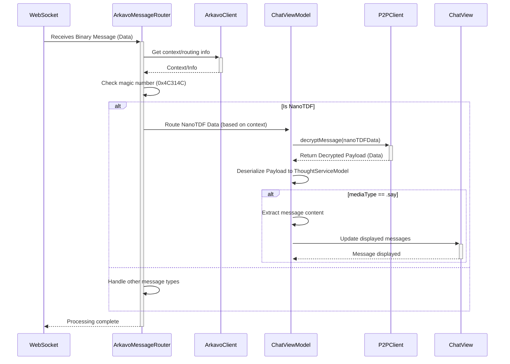
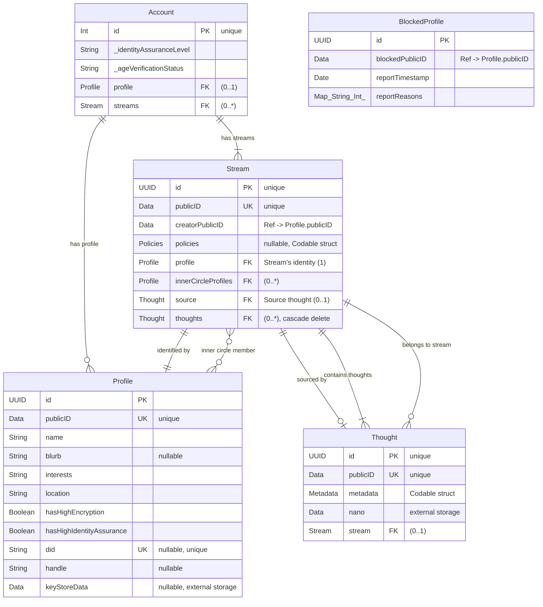

# Arkavo app
_for the Apple ecosystem_

## Prerequisites

Flatbuffers
https://github.com/google/flatbuffers

```shell
brew install flatbuffers
```

## Design

### Entity

- Account
- Profile
- Stream
- Content
- Thought

## Features

### One-Time TDF (Trusted Data Format)

One-Time TDF combines the trusted data format with a one‑time pad encryption scheme to achieve perfect forward secrecy for each message. Key features include:

- **Perfect Forward Secrecy**: Every message is encrypted with a unique, randomly generated key that is discarded after a single use.
- **Peer-to-Peer Communication**: Devices discover and communicate directly (using frameworks like MultipeerConnectivity) without relying on a central server.
- **Secure Key Exchange**: Peers securely exchange public keys via a PublicKeyStore, enabling encrypted key sharing while keeping private keys secret.
- **Inner Circle Group**: Automatically creates a private communication group (an “inner circle”) for trusted contacts.
- **Automatic Key Rotation and Renewal**: Keys are automatically marked as used and regenerated when the key store nears depletion.
- **Scalable Implementation**: Supports a large key pool (e.g., capacity of 8192 keys) to cover extended messaging needs over time.

#### Technical Implementation

- **P2P Discovery and Messaging**: Uses the MultipeerConnectivity framework for secure, nearby device discovery and direct messaging.
- **PublicKeyStore Integration**: Implements a secure key exchange mechanism where only public keys are shared, and each message is encrypted using a one‑time key from the recipient’s key pool.
- **One-Time Key Usage**: Each message uses a unique key from the key store. After encryption, the key is immediately removed (or flagged as “used”) to enforce one‑time use.
- **Automatic Key Management**: A key management system automatically monitors the key pool and generates new keys (using CryptoKit or secure hardware) when the pool runs low.
- **TDF Packaging**: The encrypted payload is wrapped in a TDF container (leveraging OpenTDFKit) that binds attribute‑based policies to the data, ensuring end‑to‑end security and auditability.

#### Security Benefits

- **Robust Confidentiality**: Even if keys are later compromised, previously used one‑time keys leave past messages secure.
- **Decentralized and Serverless**: Eliminates the need for a central key server, reducing single points of failure and attack.
- **End-to-End Protection**: Encrypts messages directly between peers without intermediaries, ensuring data integrity and confidentiality.
- **Interoperability with TDF Infrastructure**: Seamlessly integrates with existing Trusted Data Format encryption systems, enabling enhanced policy enforcement and auditability.

## Development

### WebSocket NanoTDF Decryption Process

A WebSocket receives a binary message. The `ArkavoMessageRouter` consults the `ArkavoClient` for necessary context (like user session or routing details). The router then checks if the message is a NanoTDF by identifying its magic number (`0x4C314C`). If it is, the NanoTDF data is routed to the appropriate `ChatViewModel`. The `ChatViewModel` utilizes the `P2PClient` to decrypt the NanoTDF payload. The resulting decrypted data is then deserialized into a `ThoughtServiceModel`. If the message type is `.say` (indicating a chat message), the content is extracted and displayed in the `ChatView`.



### Initialize

#### Secrets

Under `Arkavo/` create `.env`

```
PATREON_CLIENT_ID=
PATREON_CLIENT_SECRET=
```

```shell
source .env; echo "// Do not commit.
struct Secrets {
    static let youtubeClientId = "${YOUTUBE_CLIENT_ID}"
    static let youtubeClientSecret = "${YOUTUBE_CLIENT_SECRET}"
    static let redditClientId = "${REDDIT_CLIENT_ID}"
    static let patreonClientId = "${PATREON_CLIENT_ID}"
    static let patreonClientSecret = "${PATREON_CLIENT_SECRET}"
}" > "Arkavo/Arkavo/Secrets.swift"
source .env; echo "// Do not commit.
struct Secrets {
    static let youtubeClientId = "${YOUTUBE_CLIENT_ID}"
    static let youtubeClientSecret = "${YOUTUBE_CLIENT_SECRET}"
    static let redditClientId = "${REDDIT_CLIENT_ID}"
    static let patreonClientId = "${PATREON_CLIENT_ID}"
    static let patreonClientSecret = "${PATREON_CLIENT_SECRET}"
}" > "ArkavoCreator/ArkavoCreator/Secrets.swift"
```

Note adding `[ -f "${SRCROOT}/.env" ] && source "${SRCROOT}/.env";` to the Run Script in Build Phases may be needed.

#### Flatbuffers (if changed)

Events

```shell
flatc --binary --swift -o Arkavo/Arkavo idl/event.fbs
cd Arkavo/Arkavo
mv event_generated.swift EventServiceModel.swift
```

Entities

```shell
flatc --binary --swift -o Arkavo/Arkavo idl/entity.fbs
cd Arkavo/Arkavo
mv entity_generated.swift EntityServiceModel.swift
```

Metadata

```shell
flatc --binary --swift -o Arkavo/Arkavo idl/metadata.fbs
cd Arkavo/Arkavo
mv metadata_generated.swift MetadataServiceModel.swift
```

### Dependencies 

- OpenTDFKit https://github.com/arkavo-org/OpenTDFKit.git
- Flatbuffers

### Format

```shell
swiftformat --swiftversion 6.0 .
```

### Release build

#### Arkavo

```shell
cd Arkavo
xcodebuild -scheme Arkavo -sdk macosx -configuration Release build
xcodebuild -scheme Arkavo -sdk iphoneos -configuration Release build
```

#### ArkavoCreator

```shell
cd ArkavoCreator
xcodebuild -scheme ArkavoCreator -sdk macosx -configuration Release build
xcodebuild -scheme ArkavoCreator -sdk iphoneos -configuration Release build
```

### SwiftData ERD

